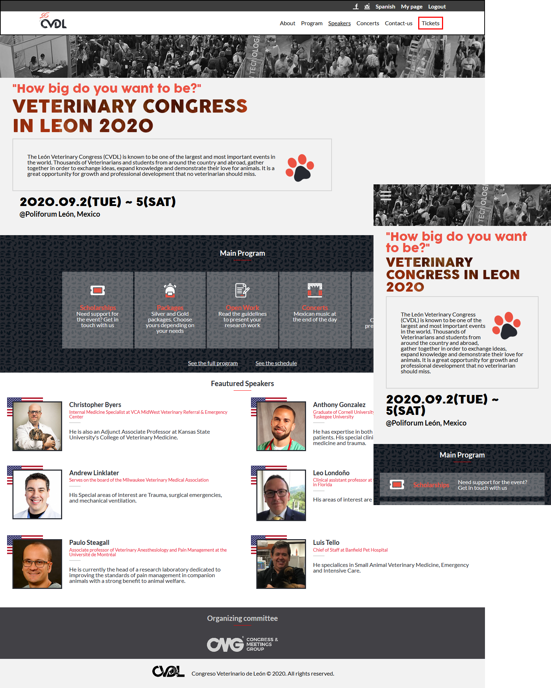

# Microverse HTML/CSS Capstone Project

This project consists of  designing a web site following a given design. The desing I used is a conference layout created by [Cindy Shin](https://www.behance.net/adagio07) for the CC Global Summit 2015. You can find the design [here](https://www.behance.net/gallery/29845175/CC-Global-Summit-2015).

As to the content I used the information from the [Veterinary Congress in Leon 2020](https://cvdl.com.mx/).

#### I. The project was based on a responsive layout with the next break points:

 - For small devices with a screen smaller than 768px.
 - For bigger devices with a screen wider than 767px

#### II. The layout was built with pure HTML and CSS (no javascript was used) by making use of:

 - Flexbox and floating elements
 - Positioning
 - HTML tables
 - Forms
 - SVG, png, and jpg images
 - Media queries
 - Backgrounds & gradients

#### III. The main areas of the project can be divided as follows:

  ###### &nbsp; The header
  It shows with all its elements on large devices whereas it collapses into a drop down menu for small devices.  

  ###### &nbsp; The main content
  It comprises the different sections distributed among four different pages: the index, the main program, the about, and  the tickets pages.

  ###### &nbsp; The footer
  It contains the congress logo and the copyright notice.

## Built With

- HTML & CSS
- Code Editors- Atom
- Gimp
- inkscape

## Live Demo

- [Live Demo Link](https://rawcdn.githack.com/Jhdezj/MC-Capstone-1/0c90aa9ed5281ea447e3efd528356039a61c9baf/index.html)
-[Video presenting the main features](https://www.loom.com/share/fa5455653cc04d2793e1c51e0e30f6eb)

## Getting Started

To get a local copy up and running follow these steps.

* #### Prerequisites:
You can use any browser updated to the current version and your regular internet connection.
* #### Setup & install:
Clone or download the project folder using the button on the top right corner of this page.
* #### Usage:
Go to the project folder and open the `index.html` file on your browser.

## Author

👤 **Jorge Hernandez**

- Github: [@Jhdezj](https://github.com/Jhdezj)
